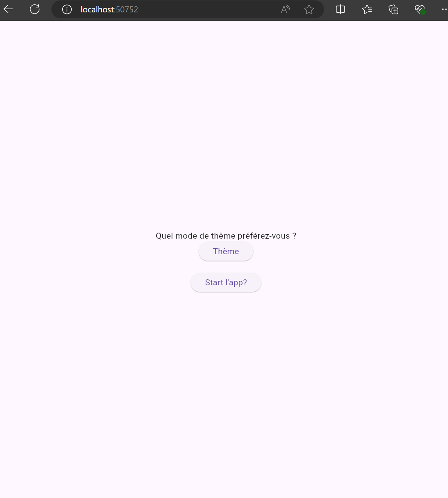
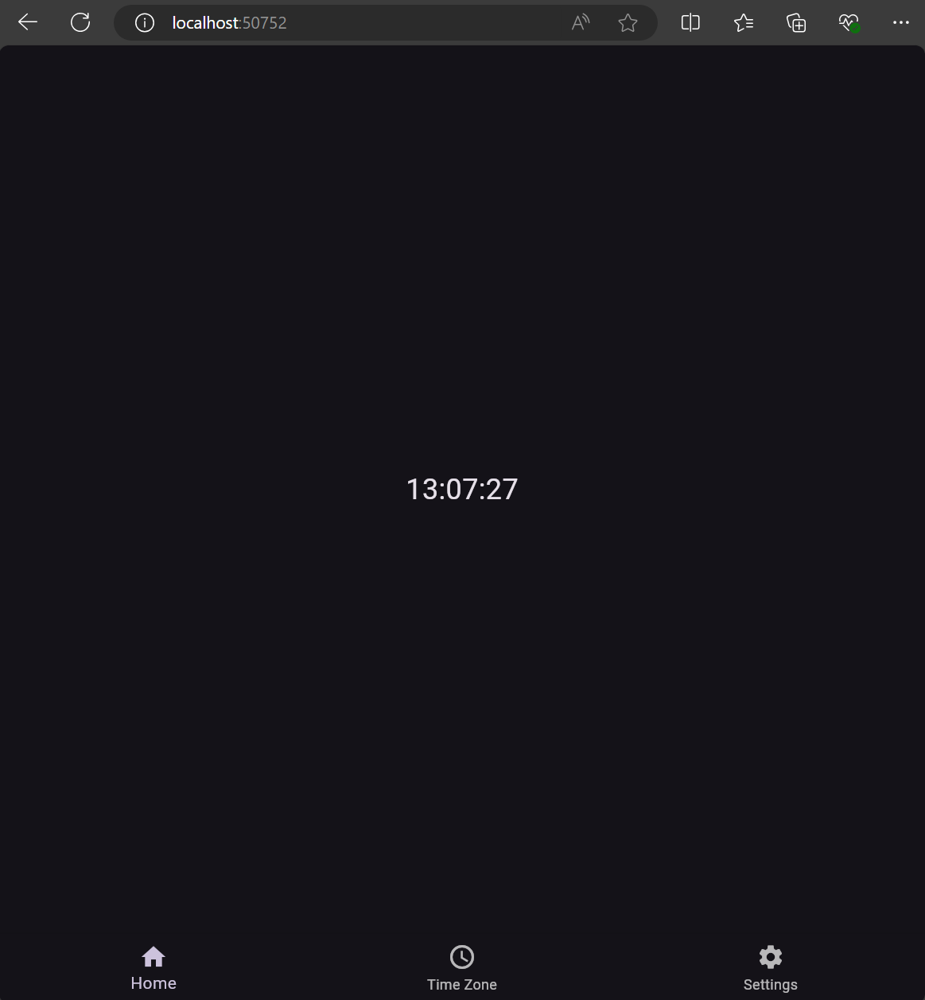
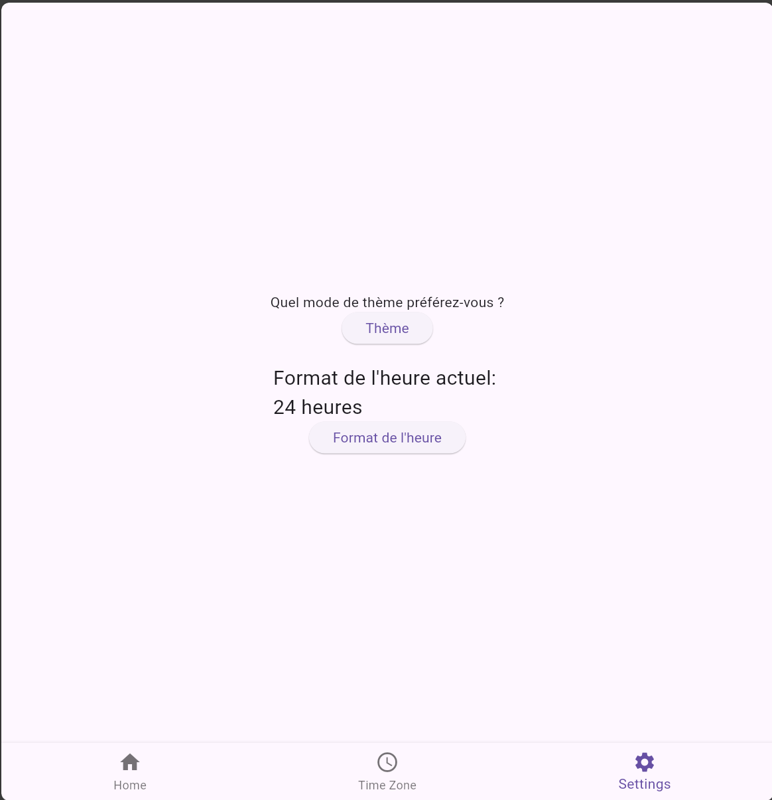
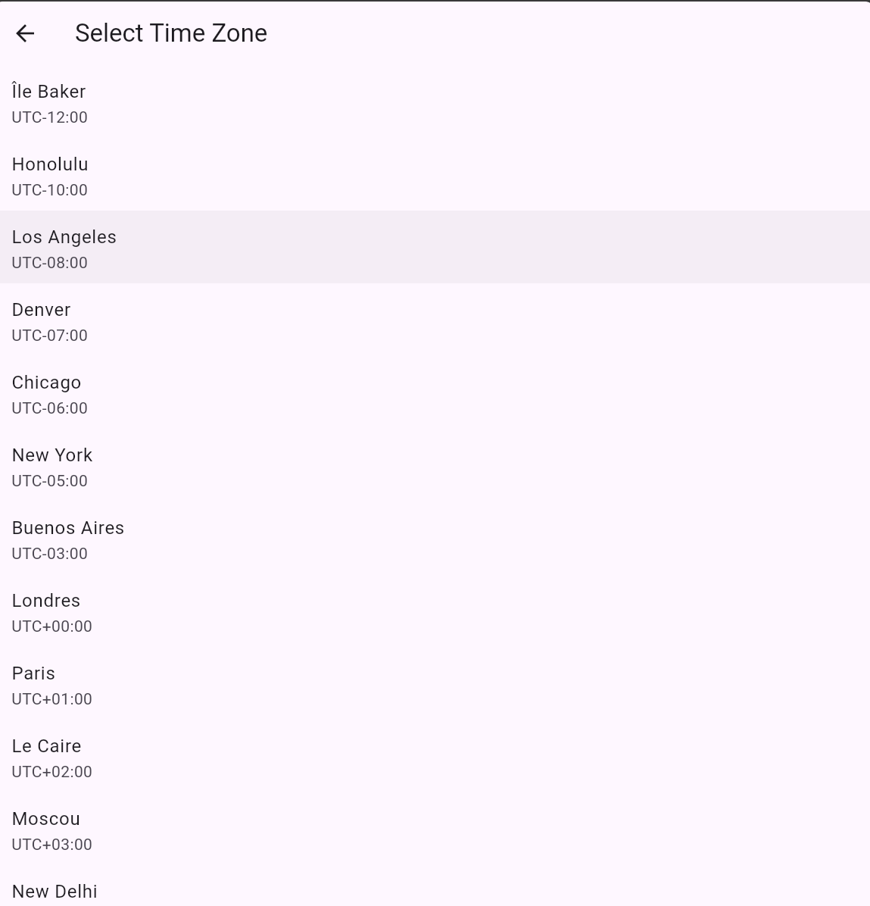

# Application Fuseau Horaire

Cette application Flutter permet aux utilisateurs de choisir un mode de couleur et d'afficher l'heure selon leur fuseau horaire préféré. L'application prend en charge les modes clair et sombre et permet aux utilisateurs de sélectionner un fuseau horaire à partir d'un fichier JSON.

## Mon environnement de développement :
IDE : Android Studio 2024.1.1
Flutter: Flutter 3.22.2
Dart :3.4.3
OS : Windows 11 Pro
Pour tester j'ai fais flutter run qui était connecter a un émulateur android et Edge pour le web dans certain cas j'ai aussi fais un run sur main.dart .

## Aperçu
Page de lancement sur edge : 
Page d'accueil sur edge : 
Page de settings sur edge : 
Page de liste des fuseaux horaires sur edge :

Les pages mobiles sont pratiquement  similaires à celles des appareils de bureau . j'ai juste séparée les pages mobile et web car j'ai une habitude de cette architecture en Flutter Web.
PS : tout est fonctionnel sur les deux plateformes hormis le boutton de changement de theme qui ne fonctionne pas j'ai essayé de le resoudre mais je pense  que c'est moi qui a mal fais l'architecture de l'application  aux début meme avec les IA je n'ai pas vraiment trouver de solutions [Le bouton réacte au print (Theme mode:ThemeMode.light ou dark) dans la console mais le theme en lui meme semble pas changer] .

## Fonctionnalités

- Choisir entre le mode clair et le mode sombre [au lancement de l'applications seulement , le boutton dans la  page settings ne fonctionne pas]
- Sélectionner un fuseau horaire à partir d'une liste prédéfinie depuis le timezone.json
- Afficher l'heure actuelle dans le fuseau horaire sélectionné

## Installation

1. Clonez le dépôt : `git clone https://github.com/votre-nom-utilisateur/app_fusio_horaire.git`
2. Accédez au répertoire de l'application : `cd app_fusio_horaire`
3. Installez les dépendances : `flutter pub get`
4. Lancez l'application : `flutter run` (avec un émulateur android activé ou un appareil connecté en mode débogage) sinon vous pouvez run le 'main.dart' sur Edge ou émulateur ou votre téléphone [Android uniquement j'ai pas tester sur IOS].

## Structure du projet

- `main.dart` : point d'entrée de l'application.
- `routes.dart` : gestionnaire de routes de l'application. [Selon les routes il send le user  vers la version mobile ou web de la page ex: home =>  screen_mobile ou screen_web]
- `themeswapper.dart` : permet à l'utilisateur de choisir entre le mode clair et le mode sombre.
- `timezone_model.dart` : modèle de données pour les fuseaux horaires.
- `components.dart` : contient les composants réutilisables de l'application.
- `timezone.json` : liste des fuseaux horaires disponibles.
- `accueil_mobile.dart` : page d'accueil pour les appareils mobiles.
- `list_timezone.dart` : page permettant à l'utilisateur de sélectionner un fuseau horaire. [Cette page était vraiment diffcile a faire car je n'ai pas l'habitude de recuperer les json dans mes applications mais surtout convertir l'heure en fonction du fuseau horaire selectionné]
- `screen_mobile.dart` : mise en page principale pour les appareils mobiles.
- `settings_mobile.dart` : page de paramètres pour les appareils mobiles.
- `accueil_web.dart` : page d'accueil pour les appareils de bureau.
- `screen_web.dart` : mise en page principale pour les appareils de bureau.
- `settings_web.dart` : page de paramètres pour les appareils de bureau.

## Contribution

0. Si vous etes sur android studio vous pouvez directement faire un get from Versionning control  dans l'interface et lancer l'application.
VS codes ou lignée de commande :
1. Fork ce dépôt.
2. Créez une branche pour votre fonctionnalité ou votre correction de bug : `git checkout -b ma-nouvelle-fonctionnalité`.
3. Commitez vos changements : `git commit -am 'Ajout d'une nouvelle fonctionnalité'`.
4. Push sur la branche : `git push origin ma-nouvelle-fonctionnalité`.
5. Ouvrez une pull request.

## Contact

Si vous avez des questions ou des suggestions, n'hésitez pas à me contacter à golam.tamim94@gmail.com

## Getting Started

This project is a starting point for a Flutter application.

A few resources to get you started if this is your first Flutter project:

- [Lab: Write your first Flutter app](https://docs.flutter.dev/get-started/codelab)
- [Cookbook: Useful Flutter samples](https://docs.flutter.dev/cookbook)

For help getting started with Flutter development, view the
[online documentation](https://docs.flutter.dev/), which offers tutorials,
samples, guidance on mobile development, and a full API reference.
